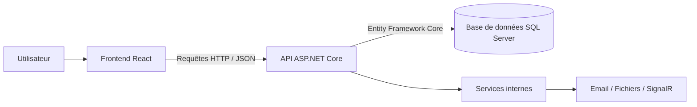
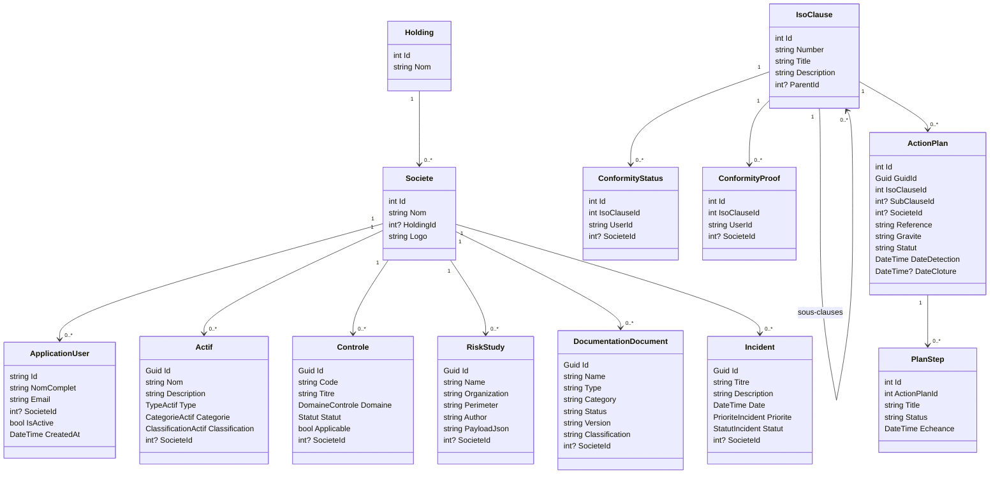
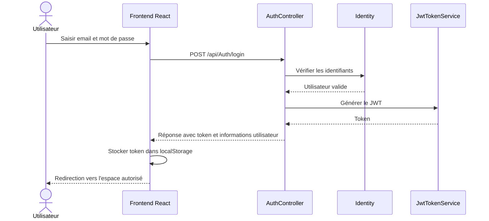
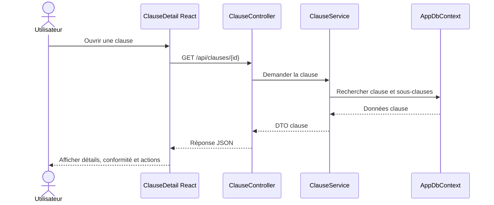
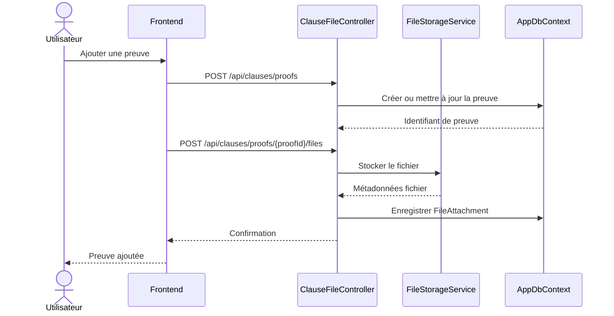
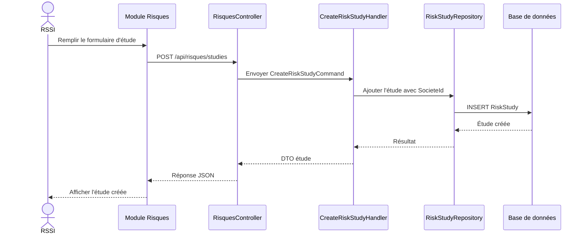
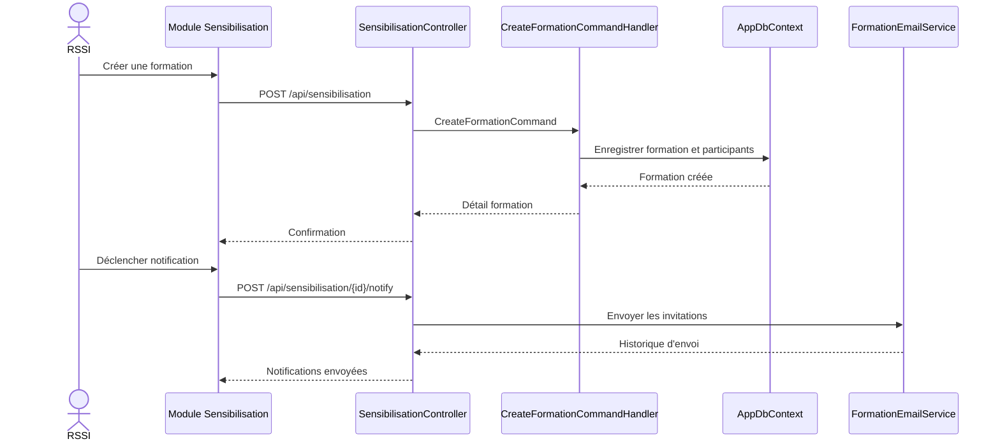
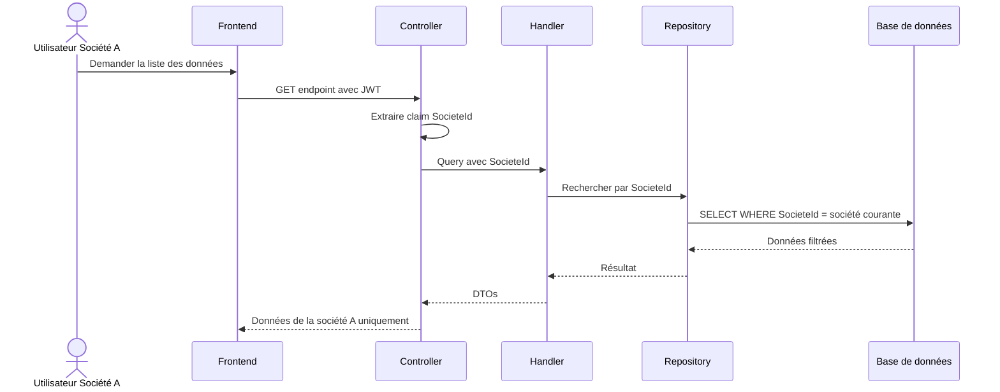

# Chapitre : Étude conceptuelle

## 1. Introduction

Ce chapitre présente la conception de l'application **SMSI Manager**, une solution web destinée à accompagner la mise en place, le suivi et l'amélioration d'un Système de Management de la Sécurité de l'Information. L'application couvre plusieurs volets liés à la gouvernance SMSI : gestion des sociétés, utilisateurs et rôles, suivi des clauses ISO, gestion des preuves de conformité, plans d'action, actifs, risques, contrôles, audits, documentation, sensibilisation, incidents et tableaux de bord.

L'objectif de cette étude conceptuelle est de décrire l'organisation générale du système, son architecture technique et applicative, ainsi que les principaux modèles UML utilisés pour représenter les interactions et les entités manipulées.

## 2. Architecture de l'application

### 2.1 Architecture globale

L'application repose sur une architecture web client-serveur. Elle est composée de trois blocs principaux :

- une interface utilisateur frontend développée avec React ;
- une API backend développée avec ASP.NET Core ;
- une base de données relationnelle gérée avec Entity Framework Core et SQL Server.

Le frontend permet à l'utilisateur d'interagir avec les différents modules fonctionnels. Lorsqu'une action est effectuée depuis l'interface, une requête HTTP est envoyée vers l'API backend. Le backend applique les règles métier, vérifie les droits d'accès, interagit avec la base de données puis retourne une réponse au frontend.

Schéma global simplifié :



Cette architecture permet de séparer clairement la présentation, la logique métier et la persistance des données. Elle facilite également l'évolution de l'application, car chaque couche peut être maintenue ou améliorée indépendamment.

### 2.2 Architecture frontend/backend

#### Frontend

Le frontend est une application React structurée autour de composants, de routes et de services API. Il utilise notamment :

- React pour la construction de l'interface ;
- React Router pour la navigation entre les pages ;
- Axios pour la communication avec le backend ;
- Tailwind CSS et CSS pour la mise en forme ;
- Recharts pour certains éléments de visualisation ;
- SignalR client pour les notifications temps réel ;
- jsPDF pour la génération/export de documents.

Les principales pages ou interfaces identifiées sont :

- page d'accueil et page de connexion ;
- tableau de bord global ;
- gestion des clauses ISO et détail d'une clause ;
- gestion des contrôles ;
- gestion des actifs ;
- module PDCA ;
- cartographie des processus ;
- documentation ;
- gestion des risques ;
- audits et non-conformités ;
- sensibilisation et formations ;
- incidents ;
- espaces d'administration : holdings, sociétés, utilisateurs, rôles et permissions.

Le frontend communique avec le backend à travers des fichiers API dédiés, par exemple :

- `auth.js` pour l'authentification ;
- `clauses.js` pour les clauses ISO ;
- `controles.js` pour les contrôles ;
- `risques.js` pour les études de risques ;
- `pdca.js` pour le cycle d'amélioration continue ;
- `cartographie.js` pour les processus ;
- `sensibilisation.js` pour les formations ;
- `audits.js` pour les audits.

L'intercepteur Axios ajoute automatiquement le jeton JWT dans l'en-tête `Authorization`. En cas de réponse `401 Unauthorized`, le frontend supprime les informations de session et redirige l'utilisateur vers la page de connexion.

#### Backend

Le backend est développé avec ASP.NET Core et suit une organisation inspirée de l'architecture en couches :

- couche API : exposition des endpoints REST via les contrôleurs ;
- couche Application : commandes, requêtes, handlers, DTOs et règles applicatives ;
- couche Domain : entités métier, interfaces et énumérations ;
- couche Infrastructure : accès aux données, repositories, services techniques et intégrations.

Le backend utilise :

- ASP.NET Core Web API ;
- Entity Framework Core ;
- ASP.NET Core Identity pour la gestion des utilisateurs ;
- JWT Bearer pour l'authentification ;
- MediatR pour séparer les requêtes/commandes de leur traitement ;
- SignalR pour les notifications ;
- FluentEmail, MailKit et SMTP pour les envois d'e-mails ;
- Swagger pour la documentation technique de l'API ;
- des services hébergés pour les rappels et le monitoring e-mail.

Les principaux contrôleurs exposés sont :

| Contrôleur | Rôle |
|---|---|
| `AuthController` | Connexion, inscription, statut utilisateur, profil courant |
| `UserController` | Gestion des utilisateurs et permissions |
| `RoleController` | Gestion des rôles |
| `PermissionController` | Attribution et révocation des permissions |
| `SocieteController` | Gestion des sociétés |
| `HoldingController` | Gestion des holdings |
| `ClauseController` | Clauses ISO, conformité, statistiques et plans d'action |
| `ClauseFileController` | Gestion des preuves et fichiers liés aux clauses |
| `ControlesController` | Consultation et mise à jour des contrôles |
| `ActifsController` | CRUD des actifs |
| `RisquesController` | Gestion des études de risques |
| `CartographieController` | Gestion des processus et documents associés |
| `DocumentationController` | Gestion documentaire et versions |
| `AuditsController` | Audits, non-conformités et simulations |
| `SensibilisationController` | Formations, participants, notifications et documents |
| `IncidentsController` | Gestion et import des incidents |
| `PdcaController` | Cycles, sections et éléments PDCA |
| `DashboardController` | Indicateurs globaux |

### 2.3 Architecture applicative

L'architecture applicative du backend est organisée autour des dossiers suivants :

```text
backend
├── API
│   ├── Controllers
│   └── Hubs
├── Application
│   ├── Commands
│   ├── Queries
│   ├── DTOs
│   └── Security
├── Domain
│   ├── Entities
│   ├── Interfaces
│   └── Enumerations
└── Infrastructure
    ├── Data
    ├── Repositories
    ├── SeedData
    └── Services
```

Cette organisation permet une séparation des responsabilités :

- les contrôleurs reçoivent les requêtes HTTP ;
- les commandes et requêtes représentent les intentions métier ;
- les handlers contiennent le traitement applicatif ;
- les repositories encapsulent l'accès aux données ;
- les entités représentent les objets métier ;
- les DTOs servent à transporter les données entre l'API et le frontend ;
- les services d'infrastructure gèrent les besoins techniques comme les fichiers, les e-mails, les notifications ou les jetons JWT.

Le frontend est organisé comme suit :

```text
frontend
├── public
├── src
│   ├── api
│   ├── assets
│   ├── components
│   ├── context
│   ├── hooks
│   └── utils
```

Les composants React sont regroupés par module fonctionnel. Les appels API sont centralisés dans le dossier `api`, ce qui évite de mélanger la logique d'affichage avec la logique de communication HTTP.

### 2.4 Sécurité et gestion des accès

L'application utilise ASP.NET Core Identity pour gérer les comptes utilisateurs. Chaque utilisateur possède un identifiant, un nom complet, un e-mail, un état actif/inactif et éventuellement une société associée.

L'authentification est basée sur des jetons JWT. Après une connexion réussie, le backend génère un token contenant les informations nécessaires à l'identification de l'utilisateur, notamment ses rôles et son rattachement à une société.

Les rôles principaux identifiés sont :

- Super Admin ;
- Admin Société ;
- RSSI ;
- Auditeur ;
- Consultant.

Le Super Admin possède une vision globale de la plateforme et peut gérer les sociétés, holdings et administrateurs. Les autres utilisateurs sont généralement rattachés à une société et ne manipulent que les données de cette société.

L'application applique une logique d'isolation multi-société à travers le champ `SocieteId`. Le principe est le suivant :

1. le contrôleur extrait l'identifiant de la société depuis le JWT ;
2. cet identifiant est transmis aux commandes ou requêtes ;
3. les handlers et repositories filtrent les données par `SocieteId` ;
4. lors de la création, l'entité est associée à la société courante ;
5. lors d'une modification ou suppression, le backend vérifie que l'entité appartient bien à la société de l'utilisateur.

Cette approche évite qu'un utilisateur d'une société puisse consulter ou modifier les données d'une autre société.

### 2.5 Architecture des données

La base de données est manipulée par Entity Framework Core via `AppDbContext`. Les principales tables représentées sont :

- `Users` : utilisateurs de l'application ;
- `Holdings` : regroupements de sociétés ;
- `Societes` : sociétés clientes ;
- `IsoClauses` : clauses et sous-clauses ISO ;
- `ConformityStatuses` : statut de conformité associé à une clause ;
- `ConformityProofs` : preuves de conformité ;
- `ActionPlans` : plans d'action liés aux clauses ou non-conformités ;
- `PlanSteps` : étapes d'un plan d'action ;
- `Controles` : contrôles de sécurité ;
- `Actifs` : actifs informationnels ;
- `RiskStudies` : études de risques ;
- `DocumentationDocuments` : documents internes, versions et métadonnées ;
- `Processus` et `Documents` : cartographie des processus et documents associés ;
- `Audits`, `AuditControlStatuses`, `NonConformites`, `ActionsCorrectives` : gestion des audits ;
- `Formations`, `FormationParticipants`, `FormationDocuments`, `FormationNotifications` : sensibilisation ;
- `Incidents` : incidents de sécurité ;
- `PdcaCycles`, `Sections`, `PdcaItems` : cycles d'amélioration continue ;
- `Modules`, `Actions`, `Permissions` : système de permissions applicatives.

### 2.6 Environnement de développement, test et livraison

L'environnement de développement repose sur :

- un backend ASP.NET Core exécuté localement ;
- un frontend React lancé avec `npm start` ;
- une base de données SQL Server ;
- Swagger pour tester les endpoints ;
- Git pour le versionnement ;
- des fichiers de configuration `appsettings` pour les paramètres du backend.

Le projet contient également un script PowerShell `start-smsi-stack.ps1` permettant de faciliter le lancement de la pile applicative.

Les tests et vérifications peuvent être organisés en plusieurs niveaux :

- tests unitaires frontend avec React Testing Library ;
- tests des services API et composants ;
- tests backend des handlers et services ;
- tests d'intégration API via Swagger ou collections HTTP ;
- tests fonctionnels manuels sur les parcours clés ;
- vérification du build frontend avec `npm run build`.

La livraison consiste à générer une version stable du frontend, publier le backend et configurer l'accès à la base de données, aux fichiers, au SMTP et aux variables sensibles.

## 3. Conception détaillée

### 3.1 Acteurs du système

Les principaux acteurs sont :

| Acteur | Description |
|---|---|
| Super Admin | Administre la plateforme, les holdings, sociétés, rôles et administrateurs |
| Admin Société | Gère les utilisateurs et données de sa société |
| RSSI | Pilote les activités SMSI : risques, contrôles, clauses, incidents, documentation |
| Auditeur | Consulte et renseigne les audits, contrôles et non-conformités |
| Consultant | Accompagne l'organisation dans le suivi SMSI et peut accéder aux modules autorisés |
| Système | Exécute les traitements automatiques : notifications, rappels, monitoring e-mail |

### 3.2 Diagramme de cas d'utilisation global

```mermaid
flowchart TB
    SA[Super Admin]
    AS[Admin Société]
    R[RSSI]
    A[Auditeur]
    C[Consultant]
    SYS[Système]

    UC1[Gérer holdings et sociétés]
    UC2[Gérer utilisateurs, rôles et permissions]
    UC3[S'authentifier]
    UC4[Consulter tableau de bord]
    UC5[Gérer clauses ISO et conformité]
    UC6[Gérer plans d'action]
    UC7[Gérer actifs]
    UC8[Gérer risques]
    UC9[Gérer contrôles]
    UC10[Gérer audits et non-conformités]
    UC11[Gérer documentation]
    UC12[Gérer sensibilisation et formations]
    UC13[Gérer incidents]
    UC14[Gérer PDCA]
    UC15[Envoyer notifications et rappels]

    SA --> UC1
    SA --> UC2
    AS --> UC2
    AS --> UC4
    R --> UC3
    R --> UC4
    R --> UC5
    R --> UC6
    R --> UC7
    R --> UC8
    R --> UC9
    R --> UC10
    R --> UC11
    R --> UC12
    R --> UC13
    R --> UC14
    A --> UC9
    A --> UC10
    C --> UC5
    C --> UC8
    C --> UC11
    SYS --> UC15
```



### 3.3 Description textuelle des cas d'utilisation

#### Cas 1 : S'authentifier

| Élément | Description |
|---|---|
| Acteur principal | Utilisateur |
| Précondition | L'utilisateur possède un compte actif |
| Déclencheur | L'utilisateur saisit son e-mail et son mot de passe |
| Scénario nominal | Le frontend envoie les identifiants au backend ; le backend vérifie les informations avec Identity ; un JWT est généré ; le frontend stocke le token et redirige l'utilisateur vers son espace |
| Exception | Identifiants incorrects, compte inactif ou verrouillé |
| Postcondition | L'utilisateur est connecté et peut accéder aux modules autorisés |

#### Cas 2 : Gérer les clauses ISO et la conformité

| Élément | Description |
|---|---|
| Acteur principal | RSSI, Auditeur, Consultant |
| Précondition | L'utilisateur est authentifié |
| Déclencheur | L'utilisateur ouvre le module des clauses |
| Scénario nominal | Le système affiche la liste des clauses ; l'utilisateur consulte une clause ; il renseigne le statut de conformité ; il ajoute des preuves ; il crée éventuellement un plan d'action |
| Exception | Absence de droit ou données non associées à la société courante |
| Postcondition | Le niveau de conformité et les preuves sont enregistrés |

#### Cas 3 : Créer un plan d'action

| Élément | Description |
|---|---|
| Acteur principal | RSSI, Auditeur |
| Précondition | Une clause ou non-conformité nécessite une correction |
| Déclencheur | L'utilisateur clique sur l'action de création d'un plan |
| Scénario nominal | L'utilisateur renseigne la référence, la gravité, la cause, les mesures immédiates, les étapes, les responsables et les échéances ; le backend enregistre le plan et ses étapes |
| Exception | Champs obligatoires manquants ou accès interdit |
| Postcondition | Le plan d'action est disponible pour suivi |

#### Cas 4 : Gérer les actifs

| Élément | Description |
|---|---|
| Acteur principal | RSSI, Admin Société |
| Précondition | L'utilisateur est rattaché à une société |
| Déclencheur | L'utilisateur accède au module actifs |
| Scénario nominal | L'utilisateur consulte, ajoute, modifie ou supprime un actif ; chaque actif est associé à une catégorie, un type et une classification |
| Exception | Tentative d'accès à un actif d'une autre société |
| Postcondition | L'inventaire des actifs est mis à jour |

#### Cas 5 : Gérer une étude de risques

| Élément | Description |
|---|---|
| Acteur principal | RSSI, Consultant |
| Précondition | L'utilisateur est authentifié |
| Déclencheur | L'utilisateur crée ou ouvre une étude de risques |
| Scénario nominal | L'utilisateur définit l'organisation, le périmètre, l'auteur et les données d'étude ; le backend stocke le contenu détaillé sous forme structurée |
| Exception | Étude inexistante ou non accessible |
| Postcondition | L'étude est enregistrée et peut être reprise ultérieurement |

#### Cas 6 : Gérer la documentation

| Élément | Description |
|---|---|
| Acteur principal | RSSI, Consultant, Auditeur |
| Précondition | L'utilisateur dispose des permissions nécessaires |
| Déclencheur | L'utilisateur ajoute ou modifie un document |
| Scénario nominal | L'utilisateur renseigne le nom, type, catégorie, statut, version, classification, auteur, approbateur et fichier ; le système conserve les métadonnées et le fichier |
| Exception | Type de fichier invalide, accès refusé ou document introuvable |
| Postcondition | Le référentiel documentaire est mis à jour |

#### Cas 7 : Gérer les audits et non-conformités

| Élément | Description |
|---|---|
| Acteur principal | Auditeur, RSSI |
| Précondition | L'utilisateur est autorisé |
| Déclencheur | L'utilisateur crée ou consulte un audit |
| Scénario nominal | Le système affiche les audits ; l'utilisateur renseigne les statuts de contrôle, crée des non-conformités et associe des actions correctives |
| Exception | Audit introuvable ou accès interdit |
| Postcondition | Les résultats d'audit et les non-conformités sont tracés |

#### Cas 8 : Gérer les sensibilisations

| Élément | Description |
|---|---|
| Acteur principal | RSSI, Admin Société |
| Précondition | Les participants sont identifiés |
| Déclencheur | L'utilisateur planifie une formation |
| Scénario nominal | L'utilisateur crée une formation, ajoute des participants, joint des documents et déclenche les notifications |
| Exception | Formation introuvable ou erreur d'envoi e-mail |
| Postcondition | La formation est planifiée et suivie |

### 3.4 Diagramme de classes principal

Le diagramme suivant représente les entités centrales du système :



### 3.5 Description des principales classes

#### ApplicationUser

Cette classe représente un utilisateur de l'application. Elle hérite du système Identity d'ASP.NET Core. Elle contient les informations d'identification, le nom complet, l'état du compte et le rattachement éventuel à une société.

#### Societe et Holding

Une société représente une organisation cliente qui utilise la plateforme. Elle peut être rattachée à un holding. Cette structure permet de gérer plusieurs sociétés dans une même application tout en isolant leurs données.

#### IsoClause

Cette classe représente une clause ou sous-clause ISO. Elle possède une relation auto-référencée grâce à `ParentId`, ce qui permet de représenter une hiérarchie de clauses.

#### ConformityStatus et ConformityProof

Ces classes permettent de suivre l'état de conformité d'une clause et les preuves associées. Elles sont liées à une clause, un utilisateur et éventuellement une société.

#### ActionPlan et PlanStep

Un plan d'action décrit une non-conformité ou une action corrective à mener. Il contient les informations de détection, d'analyse des causes, d'actions immédiates, de planification, de vérification et de clôture. Les étapes détaillées sont représentées par `PlanStep`.

#### Actif

Un actif représente une ressource informationnelle ou technique à protéger. Il possède un type, une catégorie et une classification.

#### Controle

Un contrôle représente une mesure de sécurité. Il contient son code, son titre, son domaine, son applicabilité, son statut et les informations liées à l'évaluation.

#### RiskStudy

Une étude de risques contient les informations générales de l'étude ainsi qu'un champ `PayloadJson` permettant de stocker les données détaillées de l'analyse.

#### DocumentationDocument

Cette classe représente un document du référentiel documentaire. Elle stocke les informations de version, statut, classification, auteur, approbateur et fichier associé.

#### Incident

Un incident contient un titre, une description, une date, une priorité, un statut et une résolution éventuelle.

### 3.6 Diagrammes de séquence

#### Séquence 1 : Authentification



#### Séquence 2 : Consultation du détail d'une clause



#### Séquence 3 : Ajout d'une preuve de conformité



#### Séquence 4 : Création d'une étude de risques



#### Séquence 5 : Création d'une formation de sensibilisation



#### Séquence 6 : Isolation multi-société



## 4. Choix de conception

### 4.1 Choix d'une API REST

L'utilisation d'une API REST permet de séparer le frontend et le backend. Les échanges sont réalisés au format JSON, ce qui facilite l'intégration avec React et rend l'application évolutive.

### 4.2 Choix d'une architecture en couches

La séparation entre API, Application, Domain et Infrastructure améliore la maintenabilité. Les contrôleurs restent simples, tandis que la logique métier est centralisée dans les handlers et services.

### 4.3 Choix de MediatR

MediatR permet d'organiser les traitements sous forme de commandes et requêtes. Ce choix rend le code plus lisible, car chaque action métier possède son propre handler.

### 4.4 Choix de JWT

Le JWT est adapté à une application web découplée. Il permet au frontend d'envoyer le token dans chaque requête et au backend de vérifier l'identité et les rôles de l'utilisateur.

### 4.5 Choix de l'isolation par SocieteId

Le système étant multi-société, l'isolation des données est essentielle. Le champ `SocieteId` permet de filtrer les entités métier selon la société courante, ce qui renforce la confidentialité des données.

### 4.6 Choix de SignalR et services hébergés

SignalR est utilisé pour les notifications temps réel. Les services hébergés permettent d'exécuter des traitements automatiques en arrière-plan, comme les rappels ou le monitoring e-mail.

## 5. Conclusion

L'étude conceptuelle montre que l'application SMSI Manager est structurée autour d'une architecture web moderne, modulaire et sécurisée. Le frontend React assure une interface riche et interactive, tandis que le backend ASP.NET Core centralise la logique métier, l'authentification, l'accès aux données et les services techniques.

La conception détaillée met en évidence les principaux acteurs, les cas d'utilisation essentiels, les entités métier et les scénarios d'interaction. Grâce à l'architecture en couches, à l'utilisation de MediatR, à l'authentification JWT et à l'isolation multi-société, l'application dispose d'une base solide pour gérer les processus SMSI de manière fiable, évolutive et sécurisée.
